___

# Keywords

___
> Arduino, Kicad, The Thing Networks, Lora, Node-Red, LT-spice  

___
# Membres du groupe

> Ce projet à été réalisé par : 
> - GENEAU Téo
> - KHALED Walid
> - LEON Florian
> 
___
# Description générale du projet 

Nous voulons dans ce projet réaliser un smart device, nous voulons récupérer les données d’un capteur de gaz et les envoyer via le protocole LORA sur le site TTN et ensuite afficher les données du capteur sur un Dashboard sur Node-Red. Nous nous intéressons aussi à la consommation d’Energie du capteur, donc nous allons utiliser le capteur sous un mode réveillé (très bref moment) pour mesurer et envoyer les données et un autre mode endormi où il ne consomme quasiment rien (pendant la majorité du temps).     

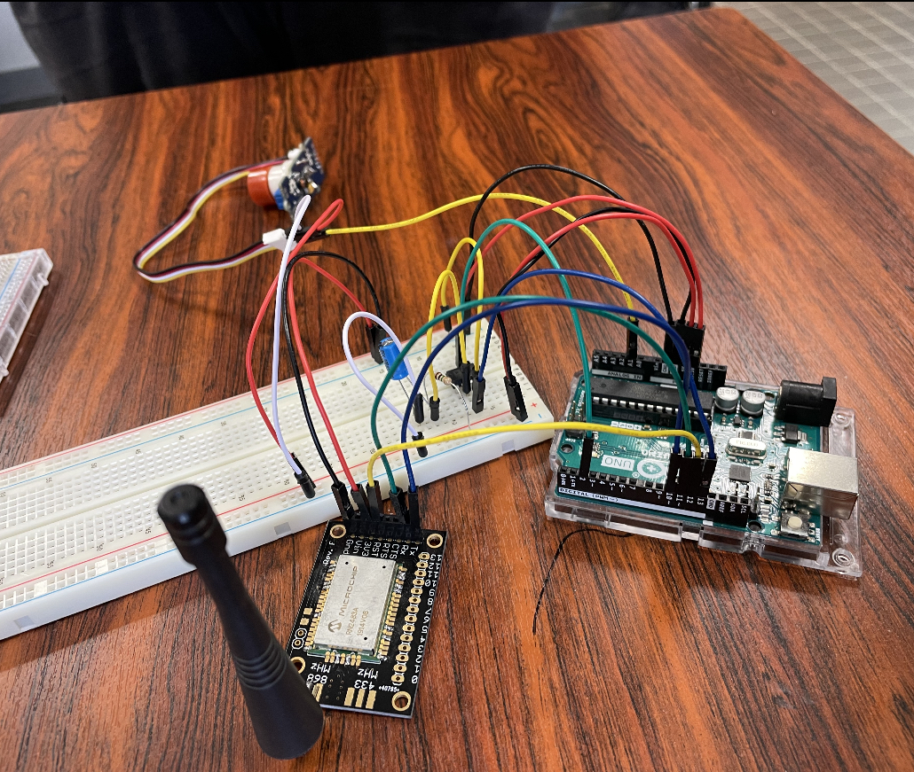
___
# Partie 1 : Conception du PCB 

Le Shield contient un circuit d’adaptation d’impédance pour relier le capteur de gaz au microcontrôleur (Arduino Uno) ainsi qu’un circuit d’interruption qui gère les deux mode «Sleep» et «Wake-up» du circuit et du capteur de gaz.

Un connecteur est prévu pour relier le circuit à l’antenne LORA. 

L’emplacement réservé au capteur de gaz est au milieu du PCB en forme de petits cercles. 

### **Schéma Kicad**

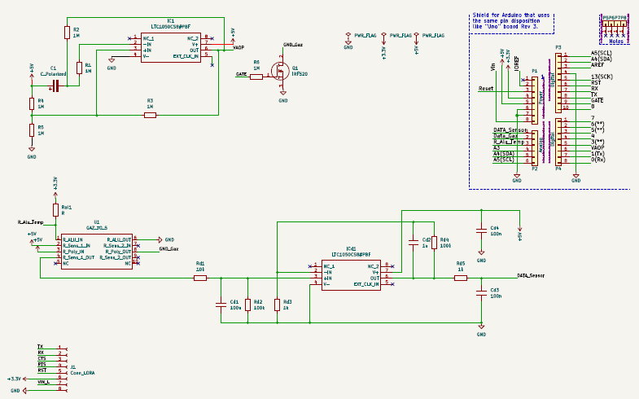    

### **Visualisation du PCB** 

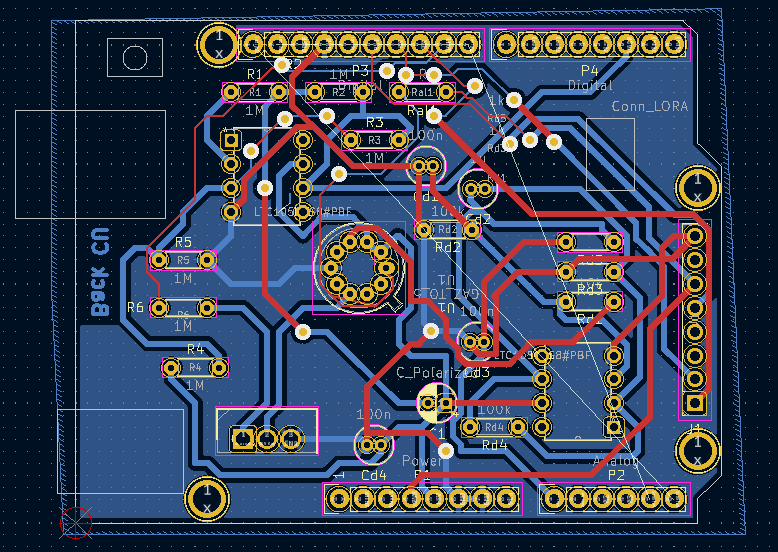

### **Visualisation du Shield en 3D** 

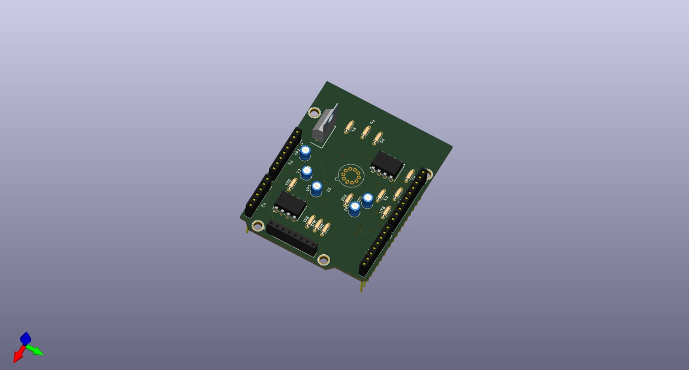
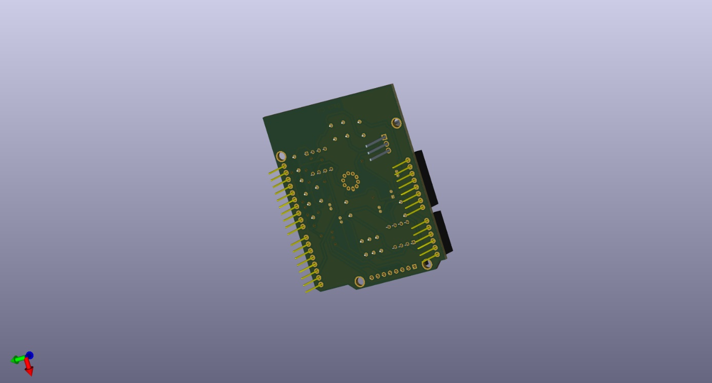

___
# Partie LT-SPICE 

Afin de simuler notre circuit d’interruption et gérer la consommation d’Energie du circuit nous avons utilisé LT-SPICE afin de simuler le comportement que nous désirons. 

Nous remarquons sur les deux figures suivantes qu’en variant les paramètres des différents composants du circuit notamment les résistances, nous parvenons à contrôler la durée d’interruption. 

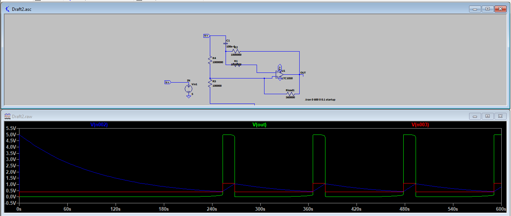
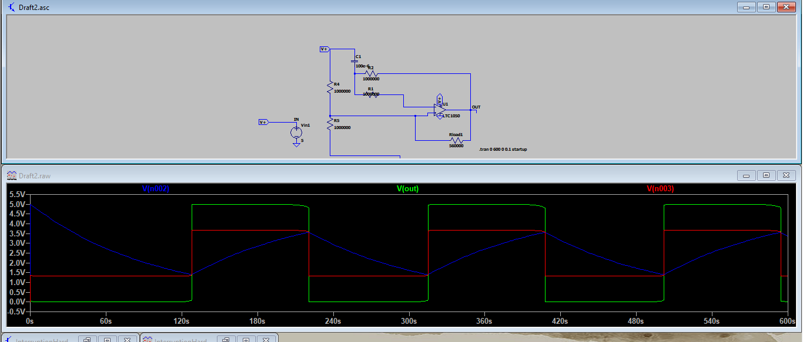

___
# Partie Arduino 

Nous utilisons l’Arduino UNO comme microcontrôleur accompagné d’une bread-bord pour monter le circuit prototype (circuit d’interruption + capteur de gaz groove + Antenne LORA). 

> Le code Arduino est composé des parties suivantes : 
>
> - Une partie d’acquisition des données du capteur et affichage sur moniteur série  
> - Une partie de configuration de la connexion TTN – LORA 
> - Une partie de gestion des deux modes Sleep et Wake-Up 

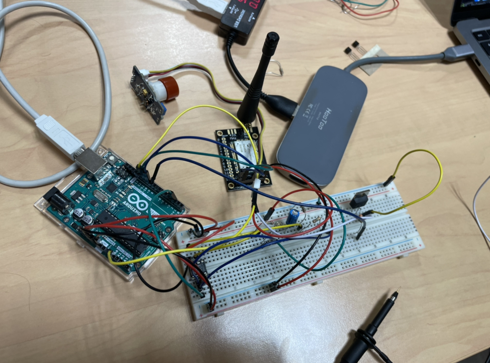

### **Affichage des données sur TTN** 

Les données sont envoyées sur le site TTN via LORA. 

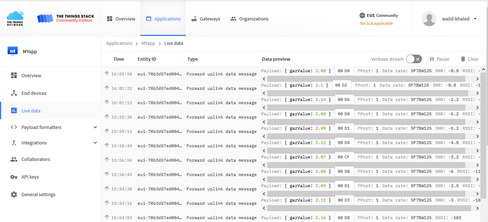
### **Partie consommation Energie**

Dans le but de diminuer au maximum la consommation d’Energie de notre système, nous avons utilisé un circuit d’interruption, nous arrivons même à éteindre et à rallumer le capteur avec ce circuit en rajoutant un transistor ce qui réduit énormément la consommation d’Energie du circuit car c’est le capteur qui consomme la quasi-totalité de l’Energie consommée par tout le circuit.

Ainsi, nous avons mis en place deux types d’interruption pour optimiser la consommation de notre circuit : une interruption matérielle et logicielle.

Notre interruption matérielle consiste en un déclenchement cyclique externe.

Pour cela, nous avons utilisé un AOP pour faire un comparateur, le circuit permet de généré des ondes carrées bases fréquences et de créer un circuit oscillateur permettant de faire varier la tension entre 0 et 5V de manière cyclique. Il est possible de modifier la fréquence en modifiant les valeurs de la capacité ou bien des résistances. En effet, si on augmente par exemple la valeur de la capacité, la fréquence diminuera et inversement. 

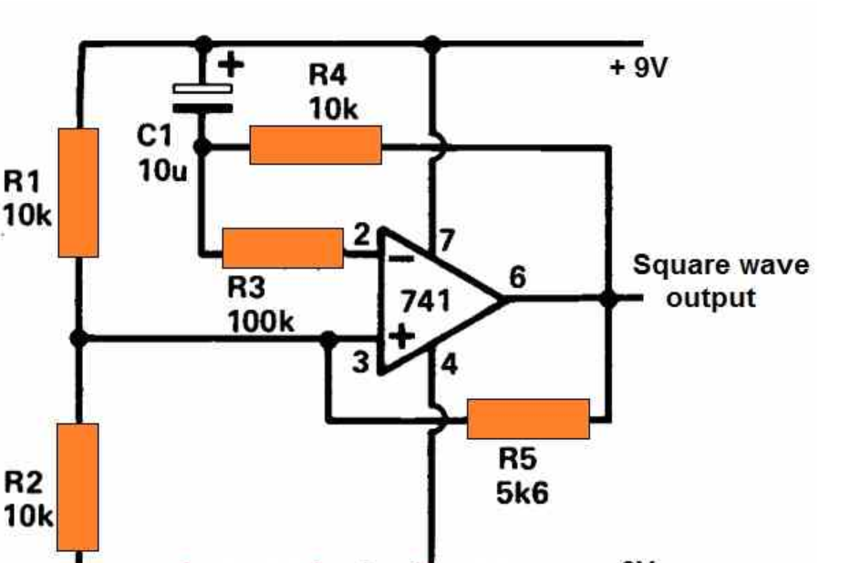

Nous avons simulé le circuit sur LT-Spice pour le choix des valeurs des résistances et de la capacité afin d’obtenir des périodes d’activités et d’inactivités adaptées à notre application.

L’interruption logicielle est réalisée par le code présent sur la carte. On réalise une interruption logicielle lorsque le circuit est dans une période inactive pour activer ou désactiver le capteur de gaz.

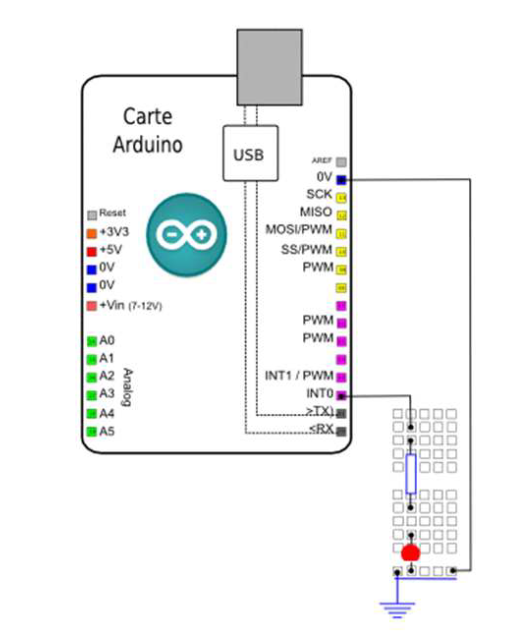

<ins>*Schéma du montage pour l’interruption logicielle (ici une LED à la place du capteur de gaz)*</ins>

Les figures suivantes montrent le comportement du système : 

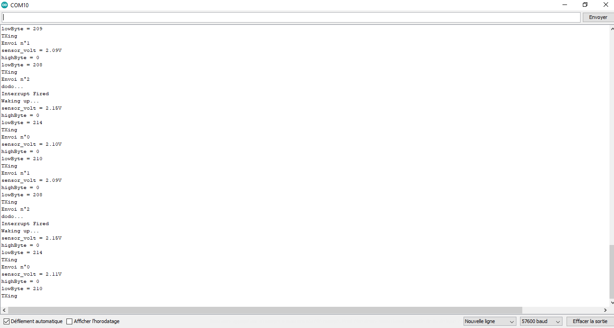

L’interruption est annulée et le capteur se réveil «Wake-Up» prend la mesure et l’envoie (3 envoies pour éviter une potentiel perte du message) et se remet en mode «Sleep» pour s’en dormir. 

> «Dodo» (le capteur retourne au mode Sleep)
> 0 V en sortie de l’AOP 

> Mode Wake-Up et envoie de 3 messages (données)  
> 5 V en sortie de l’AOP

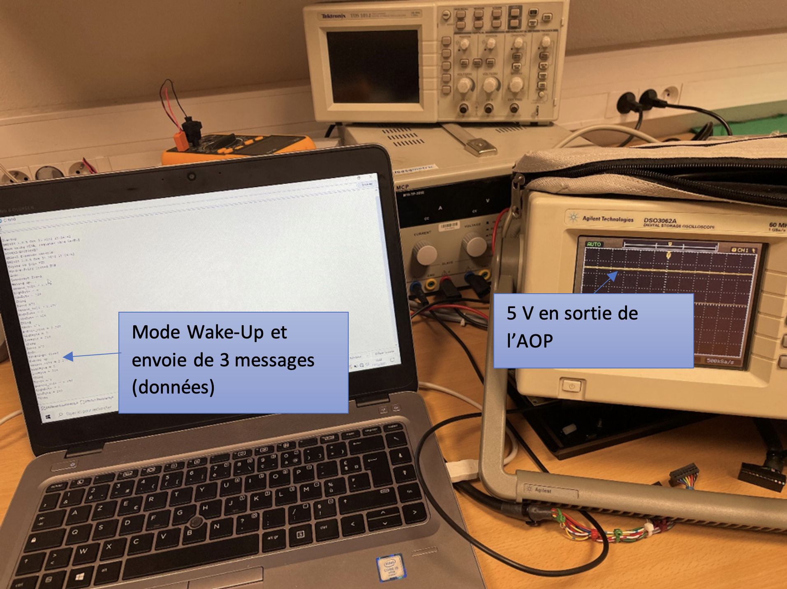

### **Bilan de puissance consommée**
Nous avons mesuré le courant en sortie du circuit, pour cela nous avons utilisé un détecteur d’intensité USB

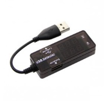

<ins><em>Détecteur de tension/intensité USB</em></ins>

Il permet de réaliser des mesures de courant consommé sur un port USB et ce en temps réel. Nous avons alors pu établir un tableau de mesures.

> Pour cela, nous avons mesurer la consommation en courant du circuit en fonction de son comportement :
> - En mode wake-up (actif), lorsque le circuit d’oscillation impose une tension à 5V.
> - En mode sleep, lorsque le circuit d’oscillation impose une tension à 0V et que le capteur de gaz est activé.
> - En mode sleep, lorsque le circuit d’oscillation impose une tension à 0V et que le capteur de gaz est désactivé par interruption logicielle.

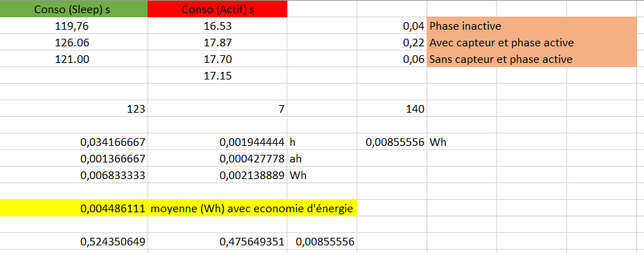

Nous pouvons observer que c’est l’interruption matérielle qui a le plus d’impact sur la consommation, en effet, on passe de **0.22 à 0.04** A lors des périodes de sleep imposées par l’AOP comparateur, soit une réduction de **0.18 A**. Tandis que, l’interruption logicielle, elle, permet une économie de **0.16 A** en passant de **0.22 A à 0.06 A**, cette interruption permet de ne plus alimenter le capteur lors de la phase active, on peut alors remarquer que c’est le capteur de gaz qui consomme le plus dans le circuit avec une consommation correspond au **0.16 A** de différence. 

De plus, on a mesuré la durée des périodes de sleep et de wake-up du circuit, on observe une période moyenne de **123 secondes** pour les périodes inactives du circuit contre 17 secondes en moyenne pour la phase active, or, l’interruption logicielle active le capteur que pour une durée de **7 secondes**.

On convertir en heure et on multiplie par les valeurs de courant correspondantes mesurées pour obtenir la mesure en Ah, puis on multiplie par le voltage (5V) pour obtenir une mesure de puissance en Wh.

On a bien :
<!-- $$
P_{sleep} = \frac{123}{3600} \cdot 0.04 \cdot 5 = 6.833 \enspace mWh
$$ --> 

contre

<!-- $$
P_{actif} = \frac{7}{3600} \cdot 0.22 \cdot 5 = 2.138 \enspace mWh
$$ --> 

Soit Pmoy la puissance moyenne de notre système avec ce mécanisme sleep/wake-up.
<!-- $$
P_{moy} = \frac{P_{sleep} + P_{actif}}{2} = 4.4861 \enspace mWh
$$ --> 

Or, sans ce mécanisme on a bien une consommation de 0.22 A et 5 V pendant 140 s (123 + 17) soit :

<!-- $$
ConsoAmpere = \frac{140}{3600} \cdot 0.22 = 0.0085 \enspace Ah
$$ --> 

et 

<!-- $$
P_{max} = ConsoAmpere \cdot 5 = 42.77 \enspace m1
$$ --> 

On observe qu’on a quasiment divisé par 10 la consommation classique avec la mise en place de nos interruptions logicielles et matérielles.

<!-- $$
5V \cdot ah = Wh 
$$ --> 

---
# Partie Node-Red 
---
Afin d’afficher les données de notre capteur, Nous utilisons Node-Red, cela se fait en établissant une connexion via le protocole MQTT entre Node-Red et le site TTN. 

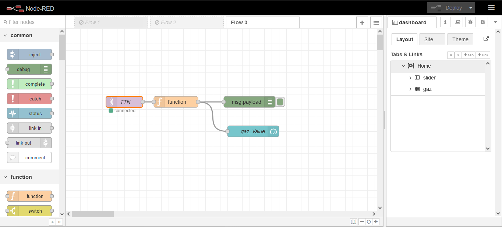

### **Paramétrage du nœud MQTT :** 

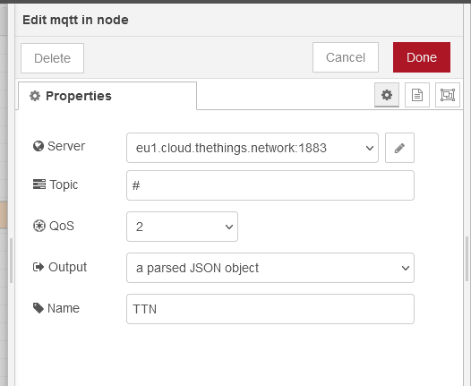

Des améliorations peuvent être faites comme par exemple afficher l’historique des valeurs de gaz pendant la journée ou bien pendant le mois…

Rajouter des boutons ou des sliders pour agir sur des actionneurs en down-link pour avertir par exemple via une alarme d’une valeur de gaz trop importante… 

___
___
